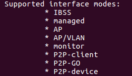

# Indoor_wifi_localization

## 测量RSSI信号数据并建立数据库

### 运行环境说明

- 建议运行环境: Macos, ubuntu 16.x as sudo, python3

- 硬件要求: 支持monitor mode的网卡

- python3 依赖: numpy, scapy, matplotlib(可视化结果)

### ubuntu 16.x

- 查看所要运行网卡编号

  > iwconfig

  

  如图这里选择wlan网卡**wlp3s0**

- 查看对应无线网卡是否支持**monitor mode**

  > iw list

   

- 修改脚本**setmon.sh**和**unsetmon.sh**,将其中的网卡名称换成对应的网卡名称

- **以管理员身份**执行**setmon.sh**，将网卡配置为**monitor mode**

  > sudo ./setmon.sh

  脚本会要求输入管理员密码，同时会关闭**network-manager**, 即之后无法使用该网卡联网

  运行之后可以执行

  > iwconfig

  确认所要运行的网卡已经处于**monitor mode**

- 配置输入SSID文件，文件中每一行对应一个所要提取rssi的AP的SSID,如下

- 以**管理员身份**运行程序**sniff_rssi.py**, 注意以**python3**执行，执行**sudo python3 sniff_rssi.py -h**查看帮助，示例运行如下

  >sudo python3 sniff_rssi.py --iface wlp3s0 --input ssids.txt --output rssi.json --amount 100

  注意程序会将提取的rssi保存为**json**

  使用 sudo 权限可能导致 python 找不到目标 module，需要调整环境变量，使用一下命令

  >sudo -HE env PATH=$PATH python3 sniff_rssi.py --iface wlp3s0 --input ssids.txt --output rssi.json --amount 100

- 运行完毕关闭**monitor mode**并开启**network-manager**

  > sudo ./unsetmon.sh

- 对于动态查看当前RSSI:

  > watch -n 0.2 nmvli dev wifi list

  > sudo iwlist wlp3s0 scan

### MacOS 

- 查看网卡编号

  > networksetup -listallhardwareports

  

  使用网卡**en0**

- 管理员身份运行**sniff_rssi.py**

  > sudo python3 sniff_rssi.py -i SSIDs.txt -o result.txt -if en0 -a 100 -t test

- 使用命令行解析RSSI，运行 **sniff_rssi_cmd.py**

  > sudo python3 sniff_rssi_cmd.py -i SSIDs.txt -o result.txt -if en0 -a 100 -t test

- 对于动态查看当前RSSI:

  先建立系统 airport 命令的软连接

  > sudo ln -s /System/Library/PrivateFrameworks/Apple80211.framework/Versions/Current/Resources/airport /usr/sbin/airport

  用 grep 和 watch 指令动态获取当前 AP 情况。

  > watch -n 0.5 "airport -s | grep 'Xiaomi'"

### 可视化测量的RSSI结果

- 使用 matplotlib 对每一个ap绘制热度图，差值方法为：bilinear。运行以下指令产生热度图。

  > python3 result_rssi_visualizer.py

  

## 建立定位模型

### 运行环境说明

- 测试通过环境: MacOS, python3.6

- python3 依赖: numpy, scapy, tensorflow(如果使用cnn模型)

### 运行前准备

- 预先测量并存储的数据，数据应由之前所述的*sniff_rssi.py*产生, **注意存储json string的文件，tag域必须为x-y 的格式，其中x y代表对应该点的浮点坐标。不同位置的RSSI使用的AP名称(SSID)必须完全一致，且要求同一个AP在不同位置测量的RSSI序列长度一致(不同AP的可以不同)。作为训练(指纹)的数据和测试的数据必须使用相同的AP名称且相同AP的序列长度一致。同时文件编码应为utf-8。参考示例文件data/train.txt和data/val.txt**

### 运行定位模型

- 运行**python locate.py -h**查看参数说明，示例运行如下

  > python locate.py --train ../data/train.txt --test ../data/val.txt --method 4NN --signal median

  输出为按照test.txt中文件的顺序依次预测的二维坐标位置以及散点图表示，示例图片见下

### 可视化预测结果

 

## 用server client模型动态定位

### 运行环境说明

- 测试通过环境: MacOS, python3.6

- python3 依赖: numpy, scapy, tensorflow(如果使用cnn模型), kivy(图形界面)

### 运行定位模型

- 默认设定为 4kNN 模型和 median 信号。总体结构为，client负责测量给定ap的RSSI信号，进行简单处理（取平均值），发送给server。server负责对接收到的数据进行分析定位，将定位结果发送给client。

- 先运行server。启动 server 运行指令：

  > python3 server.py

  再运行client。client 将启动图形界面。点击按钮**start**后，server对给定ap的RSSI测量，并将RSSI值处理发送给server。在收到server返回的预测位置后，在界面上用绿点现实位置。启动 client 运行指令

  > sudo python3 client.py

  client的图形界面示例：

  

## 参考资料

### websites & blogs 

- 关于**monitor mode**和一般网卡提取rssi的问题：https://wiki.wireshark.org/CaptureSetup/WLAN#Linux
- 开启**monitor mode**的另一工具: http://www.aircrack-ng.org/doku.php?id=airmon-ng
- MacOS命令行网络设置检查：http://osxdaily.com/2014/09/03/list-all-network-hardware-from-the-command-line-in-os-x/
- 8 Linux Commands: To Find Out Wireless Network Speed, Signal Strength And Other Information: https://www.cyberciti.biz/tips/linux-find-out-wireless-network-speed-signal-strength.html

### papers
